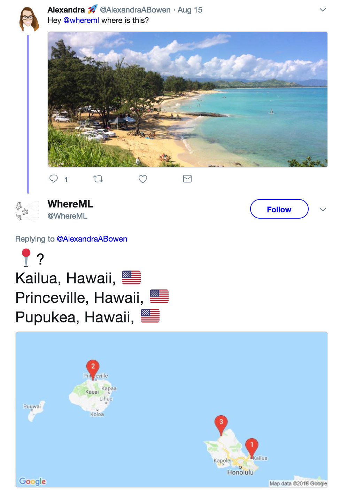
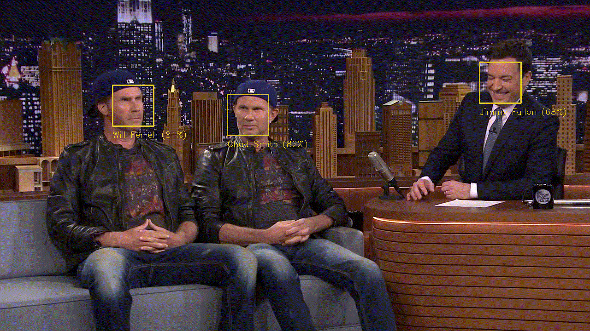
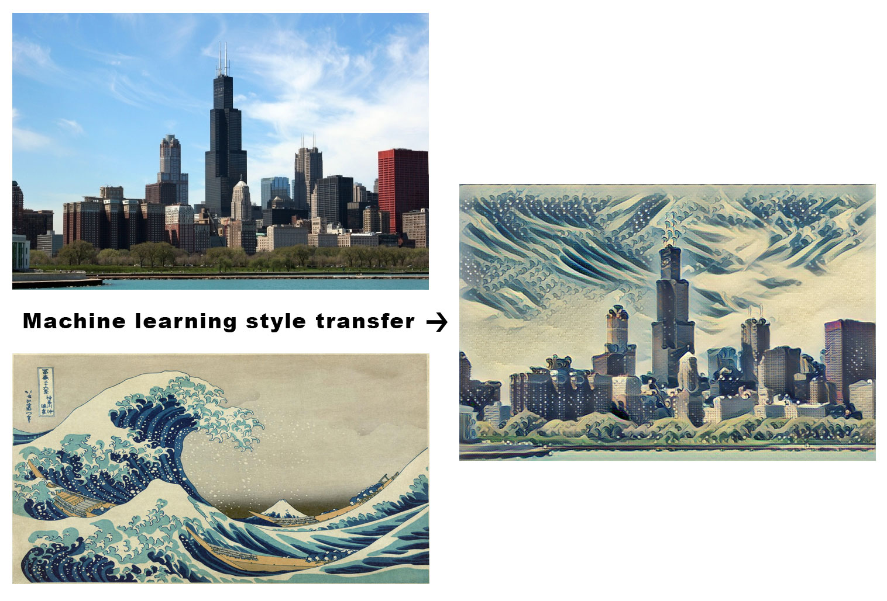
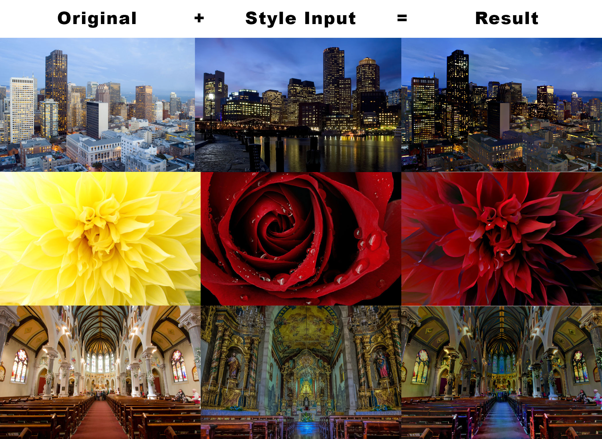
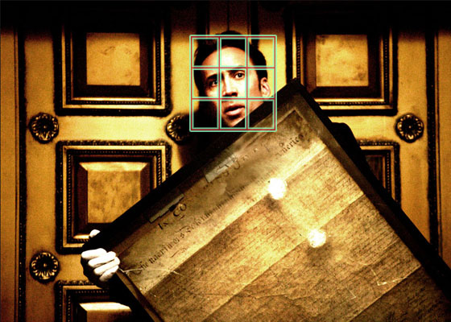

# Fun Machine Learning
The most interesting and fun machine learning code/links!  If you want exciting ML, you're in the right spot.  Please contribute and share.

<!-- START doctoc generated TOC please keep comment here to allow auto update -->
<!-- DON'T EDIT THIS SECTION, INSTEAD RE-RUN doctoc TO UPDATE -->
**Table of Contents**

- [Links](#links)
  - [:arrow_forward: `edges2cats` AKA Nightmare Cats](#arrow_forward-edges2cats-aka-nightmare-cats)
  - [:arrow_forward: WhereML - GPS of Images](#arrow_forward-whereml---gps-of-images)
  - [:arrow_forward: Machine Learning is Fun - Awesome Blog](#arrow_forward-machine-learning-is-fun---awesome-blog)
  - [:arrow_forward: Teachable Machine](#arrow_forward-teachable-machine)
- [Syle Transfers & Generators](#syle-transfers--generators)
  - [:arrow_forward: fast-style-transfer - Impressive and speedy](#arrow_forward-fast-style-transfer---impressive-and-speedy)
  - [:arrow_forward: deep-photo-transfer - Torch based deep style transfers](#arrow_forward-deep-photo-transfer---torch-based-deep-style-transfers)
- [ML Models](#ml-models)
  - [:arrow_forward: Nic or Not - Nicolas Cage Detector](#arrow_forward-nic-or-not---nicolas-cage-detector)

<!-- END doctoc generated TOC please keep comment here to allow auto update -->

## Links

### :arrow_forward: `edges2cats` AKA Nightmare Cats
Draw cats, buildings, purses and have ML bring drawings to life!

* WEBSITE: https://affinelayer.com/pixsrv/index.html

### :arrow_forward: WhereML - GPS of Images
Beautiful photos of far off places don't have to be a mystery.  Simply tag @whereml in your tweets, and get a friendly reply of that destination.

* LINK: https://twitter.com/WhereML/with_replies

### :arrow_forward: Machine Learning is Fun - Awesome Blog
One of my favorite blogs where Adam Geitgey writes up interesting articles which teach you ML concepts with fun and exciting exercises.

* LINK: https://www.machinelearningisfun.com/

### :arrow_forward: Teachable Machine
This super simple interface for teaching 3 different image classifiers is cute and fun to experiment with.  Great for beginners!

* VIDEO: https://www.youtube.com/watch?v=3BhkeY974Rg
* LINK: https://teachablemachine.withgoogle.com/
* CODE: https://github.com/googlecreativelab/teachable-machine

## Syle Transfers & Generators

### :arrow_forward: fast-style-transfer - Impressive and speedy

* LINK: https://github.com/lengstrom/fast-style-transfer
* BLOG: https://hackernoon.com/diy-prisma-fast-style-transfer-app-with-coreml-and-tensorflow-817c3b90dacd

### :arrow_forward: deep-photo-transfer - Torch based deep style transfers

* LINK: https://github.com/luanfujun/deep-photo-styletransfer

## ML Models

### :arrow_forward: Nic or Not - Nicolas Cage Detector
Attempt to find and detect Nic Cage with this recognition model.

* WEBSITE: http://declarationofindependencethief.com/
* MODEL: https://s3.amazonaws.com/despiteallmyrage/MegaNic50.mlmodel
