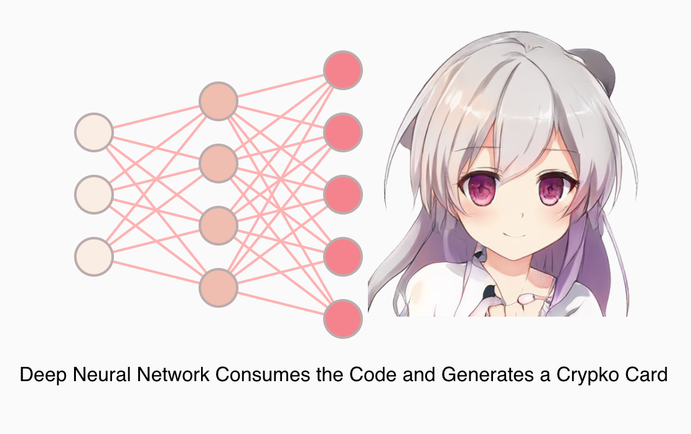
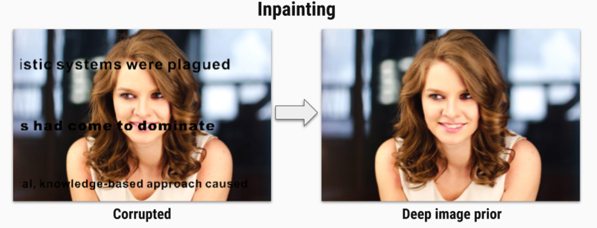
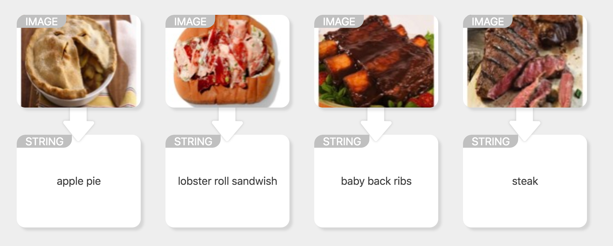
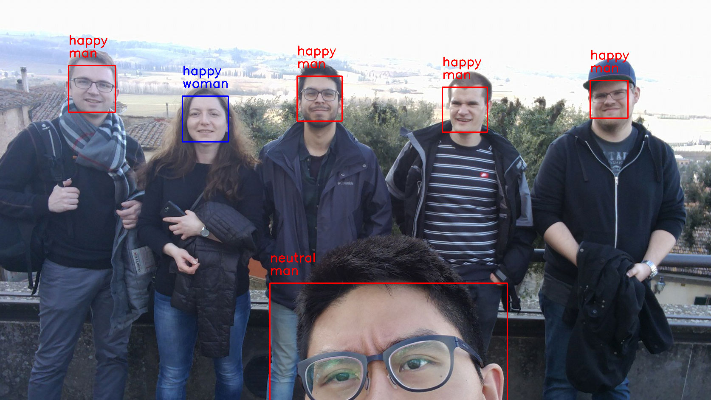

# Fun Machine Learning
The most interesting and exciting machine learning experiences!  If you want ML to be fun, you're in the right spot.  Please contribute and share.

<!-- START doctoc generated TOC please keep comment here to allow auto update -->
<!-- DON'T EDIT THIS SECTION, INSTEAD RE-RUN doctoc TO UPDATE -->
**Table of Contents**

- [Links](#links)
    - [:arrow_forward: `edges2cats` AKA Nightmare Cats](#arrow_forward-edges2cats-aka-nightmare-cats)
      - [BONUS:  Human faces](#bonus--human-faces)
    - [:arrow_forward: WhereML - GPS of Images](#arrow_forward-whereml---gps-of-images)
    - [:arrow_forward: Machine Learning is Fun - Awesome Blog](#arrow_forward-machine-learning-is-fun---awesome-blog)
    - [:arrow_forward: Teachable Machine](#arrow_forward-teachable-machine)
    - [:arrow_forward: AI Blockchain Anime - Deep Neural Network Anime](#arrow_forward-ai-blockchain-anime---deep-neural-network-anime)
- [Syle Transfers & Generators](#syle-transfers--generators)
    - [:arrow_forward: fast-style-transfer - Impressive and speedy](#arrow_forward-fast-style-transfer---impressive-and-speedy)
    - [:arrow_forward: deep-image-prior - Image cleanup](#arrow_forward-deep-image-prior---image-cleanup)
    - [:arrow_forward: deep-photo-transfer - Torch based deep style transfers](#arrow_forward-deep-photo-transfer---torch-based-deep-style-transfers)
- [ML Models](#ml-models)
    - [:arrow_forward: Nic or Not - Nicolas Cage Detector](#arrow_forward-nic-or-not---nicolas-cage-detector)
    - [:arrow_forward: Food 101 - Food Identifier](#arrow_forward-food-101---food-identifier)
    - [:arrow_forward: Face Classification - How ya feeling?](#arrow_forward-face-classification---how-ya-feeling)
- [Transfer Learning](#transfer-learning)
    - [:arrow_forward: Playing Mortal Kombat with TensorFlow.js](#arrow_forward-playing-mortal-kombat-with-tensorflowjs)
- [How to Contribute](#how-to-contribute)
    - [How to install and use `doctoc`](#how-to-install-and-use-doctoc)

<!-- END doctoc generated TOC please keep comment here to allow auto update -->

# Links

### :arrow_forward: `edges2cats` AKA Nightmare Cats
Draw cats, buildings, purses and have ML bring drawings to life!

* WEBSITE: https://affinelayer.com/pixsrv/index.html
* CODE: https://github.com/affinelayer/pix2pix-tensorflow

#### BONUS:  Human faces
* WEBSITE: https://zaidalyafeai.github.io/pix2pix/faces.html
* CODE: https://github.com/zaidalyafeai/zaidalyafeai.github.io/tree/master/pix2pix

### :arrow_forward: WhereML - GPS of Images
Beautiful photos of far off places don't have to be a mystery.  Simply tag @whereml in your tweets, and get a friendly reply of that destination.

* LINK: https://twitter.com/WhereML/with_replies

### :arrow_forward: Machine Learning is Fun - Awesome Blog
One of my favorite blogs where Adam Geitgey writes up interesting articles which teach you ML concepts with fun and exciting exercises.

* LINK: https://www.machinelearningisfun.com/

### :arrow_forward: Teachable Machine
This super simple interface for teaching 3 different image classifiers is cute and fun to experiment with.  Great for beginners!

* VIDEO: https://www.youtube.com/watch?v=3BhkeY974Rg
* LINK: https://teachablemachine.withgoogle.com/
* CODE: https://github.com/googlecreativelab/teachable-machine

### :arrow_forward: AI Blockchain Anime - Deep Neural Network Anime

* LINK: https://crypko.ai/

# Syle Transfers & Generators

### :arrow_forward: fast-style-transfer - Impressive and speedy

* LINK: https://github.com/lengstrom/fast-style-transfer
* BLOG: https://hackernoon.com/diy-prisma-fast-style-transfer-app-with-coreml-and-tensorflow-817c3b90dacd

### :arrow_forward: deep-image-prior - Image cleanup
Remove artifacts, perform inpainting, upgrade to super-resolution, and apply denoising with the magic of ML

* LINK: https://dmitryulyanov.github.io/deep_image_prior
* CODE: https://github.com/DmitryUlyanov/deep-image-prior

### :arrow_forward: deep-photo-transfer - Torch based deep style transfers

* LINK: https://github.com/luanfujun/deep-photo-styletransfer

# ML Models

### :arrow_forward: Nic or Not - Nicolas Cage Detector
Attempt to find and detect Nic Cage with this recognition model.

* WEBSITE: http://declarationofindependencethief.com/
* MODEL: https://github.com/GantMan/nicornot/tree/master/models

### :arrow_forward: Food 101 - Food Identifier
Are you a bad cook?  Just point, click, and identify if this model can even tell what it is that you cooked.  Image classification for food.

* WEBSITE: https://www.vision.ee.ethz.ch/datasets_extra/food-101/
* DATASET: http://data.vision.ee.ethz.ch/cvl/food-101.tar.gz
* COREML MODEL: https://coreml.store/food101

### :arrow_forward: Face Classification - How ya feeling?
Bad at reading people?  Don't worry, this code isn't on the spectrum, let it classify for ya!

* CODE: https://github.com/oarriaga/face_classification
* MODEL: https://github.com/oarriaga/face_classification/tree/master/trained_models

# Transfer Learning

### :arrow_forward: Playing Mortal Kombat with TensorFlow.js
Play a javascript port of Mortal Kombat by actually kicking and punching infront of your laptop webcam. Learn transfer learning and data augmentation by training your own ML model to play Mortal Kombat.

* WEBSITE: https://blog.mgechev.com/2018/10/20/transfer-learning-tensorflow-js-data-augmentation-mobile-net/
* CODE: https://github.com/mgechev/mk-tfjs

# How to Contribute
Please add your content in the appropriate section, upload an image, and start your title with :arrow_forward: so we can clearly see where each blog begins/ends.  Once your addition has been made, I suggest running `doctoc` to update the header table of contents.

### How to install and use `doctoc`

Install via npm with `npm i -g doctoc` and then run `doctoc .` in the root folder to properly update the table of contents to fit new content.
